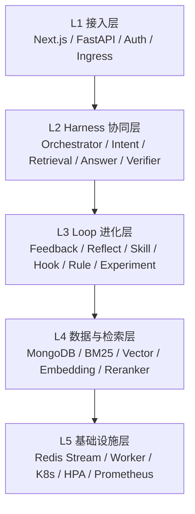
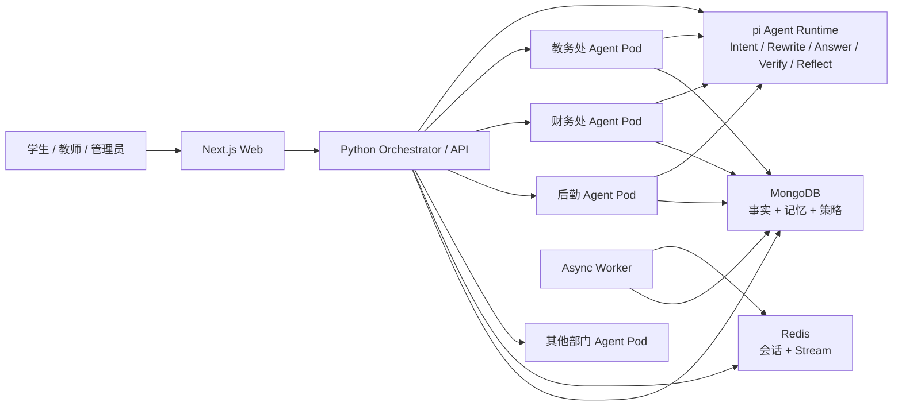
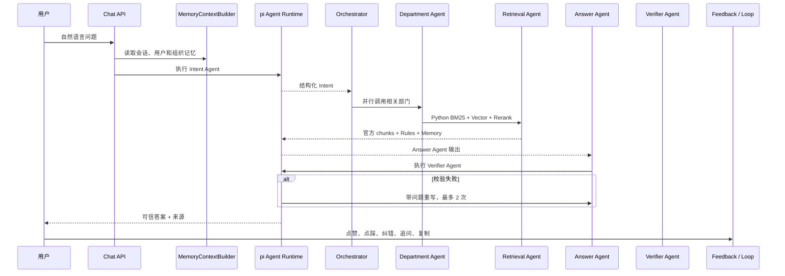
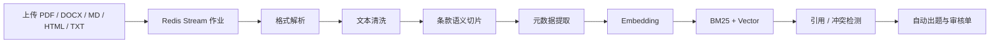
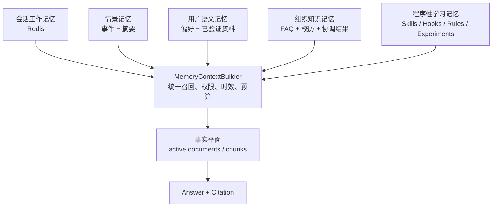
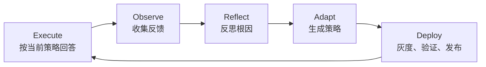

# 文枢：跨部门文档处理与问答助手代码解读

## 一、文枢解决了什么问题？

一所学校通常有教务处、学生处、财务处、研究生院、后勤与安全保卫部等多个部门。每个部门都会发布大量 PDF、Word、通知、办法和办事指南。

传统做法有三个明显问题：

1. **文件散落**：师生不知道答案在哪个部门、哪一份文件、哪一个版本中。
2. **口径容易冲突**：不同部门可能对同一个事项给出不同规定。
3. **普通问答系统不会成长**：上线时什么水平，半年以后仍是什么水平。

“文枢”希望建立一个学校制度知识中枢：

```text
部门上传制度文件
      ↓
系统自动解析、切片、版本化、建立索引
      ↓
师生用自然语言提问
      ↓
多个部门智能体协同检索和回答
      ↓
答案引用到原文和具体条款
      ↓
用户反馈、审核结果进入 Loop
      ↓
系统沉淀新的 Skill / Hook / Rule，下一次回答更好
```

如果把它比作一名学校里的“超级办事老师”：

- MongoDB 和文档索引是它的资料室；
- Intent Agent 是前台分诊老师；
- Retrieval Agent 是档案检索员；
- Answer Agent 是政策解读老师；
- Verifier Agent 是复核老师；
- Memory 是它对会话、用户和组织经验的记忆；
- Loop Engine 是它的教研和复盘机制；
- K8s 部门 Pod 是高峰期可以临时扩充的办事窗口。

***

## 二、项目运行

### 2.1 环境要求

- Python 3.9+，推荐 Python 3.11
- Node.js 22.19+
- Docker Desktop，推荐使用
- 生产模式使用 MongoDB 7 和 Redis 7

### 2.2 Docker 一键启动

在项目根目录执行：

```bash
cp .env.example .env
# 编辑 .env，配置 DEEPSEEK_API_KEY、RELAY_API_KEY 和安全密钥

docker compose up --build -d
docker compose ps
```

启动后的主要地址：

| 服务               | 地址                              |
| ---------------- | ------------------------------- |
| 学生问答和管理后台        | `http://localhost:8080`         |
| FastAPI Swagger  | `http://localhost:8000/docs`    |
| 后端健康检查           | `http://localhost:8000/healthz` |
| pi Agent Runtime | `http://localhost:8100/health`  |

> Python 是唯一控制平面，pi 是统一 Agent 执行引擎。pi 负责 Intent、Rewrite、Answer、Verify、Reflect 的模型执行；权限、事实、记忆、固定 DAG、灰度和回滚仍由 Python 控制。

### 2.3 初始化基础数据

```bash
docker compose exec backend python -m scripts.seed_data
```

该脚本会写入：

- 学校部门；
- 术语表；
- 校历；
- 默认引用规则；
- 默认禁止编造规则；
- 默认跨部门 Hook。

### 2.4 导入样例部门文档

```bash
docker compose exec backend \
  python -m scripts.ingest_department_files \
  --base /app/department_files
```

### 2.5 本地开发

后端：

```bash
cd backend
python3 -m venv .venv
source .venv/bin/activate
pip install -r requirements.txt

export STORAGE_MODE=memory
export EMBEDDING_PROVIDER=hash
export PI_AGENT_ENABLED=true

uvicorn app.main:app --reload --port 8000
```

前端：

```bash
cd web
npm install
BACKEND_URL=http://localhost:8000 npm run dev
```

### 2.6 运行测试

```bash
cd backend
.venv/bin/pytest -q

cd ../web
npm run build

cd ../services/pi-agent
npm run typecheck
```

当前后端测试基线为 **59 个测试通过**，覆盖文档切片、检索、权限、记忆、Loop、版本链、部门 Agent、pi Runtime、异步队列、基线 Skill 执行和 Loop 作业状态。

***

## 三、先看全貌：项目由哪些部分组成？

### 3.1 仓库目录

```text
program/
├── backend/                 Python FastAPI 主后端
│   ├── app/api/             REST 接口和权限
│   ├── app/harness/         多智能体固定 DAG
│   ├── app/pipeline/        文档解析和入库
│   ├── app/retrieval/       BM25、向量、RRF、Rerank
│   ├── app/memory/          事实平面与五个记忆平面
│   ├── app/loop/            反馈、反思、策略生成和回滚
│   ├── app/review/          人工审核与渐进退出
│   ├── app/storage/         MongoDB、Redis、队列
│   ├── scripts/             种子、入库、评测、迁移、Worker
│   └── tests/               单元和端到端测试
├── web/                     Next.js 学生端和管理后台
├── services/pi-agent/       pi 统一 Agent 执行引擎
├── deploy/                  Docker、K8s、Helm、HPA
├── department_files/        样例部门文件
├── design_files/            技术方案和本文档
├── docs/                    架构、API、Loop、部署说明
└── loadtest/                k6 部门弹性压测脚本
```

### 3.2 五层架构



这五层不是简单堆叠：

- L1 负责“谁能进来、请求从哪里进入”；
- L2 负责“这次问题应该怎么回答”；
- L3 负责“回答以后系统如何复盘和变强”；
- L4 负责“事实在哪里、怎样找到”；
- L5 负责“高峰能不能扛住、任务会不会丢”。

### 3.3 服务拓扑



这里最重要的设计是：**部门不是一个标签，而是真正可以独立部署和伸缩的服务单元。**

### 3.4 Python 控制平面 + pi Agent 执行平面

重构后的系统没有把整个后端迁移到 TypeScript，也没有保留两套相互竞争的 Orchestrator，而是把职责按确定性划分：

| Python 控制平面             | pi Agent 执行平面                                |
| ----------------------- | -------------------------------------------- |
| Auth、RBAC、会话所有权         | Agent loop                                   |
| 固定 DAG 和部门路由            | 模型调用                                         |
| 事实平面和官方 chunks          | Intent / Rewrite / Answer / Verify / Reflect |
| 五个记忆平面和隐私策略             | 结构化模型输出                                      |
| Skills/Hooks/Rules 选择   | 白名单 tool calling                             |
| treatment/control、发布、回滚 | Agent 局部执行状态                                 |
| 文档版本、冲突和数据存储            | 不直接访问业务数据库                                   |

统一协议为：

```json
POST /v1/agent/run
{
  "agentType": "answer",
  "systemPrompt": "……",
  "prompt": "……",
  "outputMode": "text",
  "allowedTools": [],
  "timeoutMs": 5000,
  "traceId": "trace_x"
}
```

接口要求 `X-Internal-Token`。Python 明确指定 `allowedTools`，pi 不能自行获得更多工具，也不能绕过部门和事实权限。

对应代码：

- Python 客户端：`backend/app/integrations/pi_runtime.py`；
- pi 执行协议：`services/pi-agent/src/server.ts`；
- pi Agent loop：`services/pi-agent/src/agents.ts`。

***

## 四、整个项目最关键的一条链：用户问一句话之后发生了什么？

代码入口：

- API：`backend/app/api/routes/chat.py`
- 总调度：`backend/app/harness/orchestrator.py` 的 `Orchestrator.answer()`

### 4.1 主流程



### 4.2 第一步：身份和会话所有权

接口不会相信客户端自己传来的 `user_id`。用户身份来自带 `iat/exp` 的 HMAC Token。

这意味着用户不能通过修改请求体读取别人的会话。历史会话、反馈、删除和长期记忆接口都会校验所有权。

对应代码：

- `backend/app/auth.py`
- `backend/app/api/deps.py`
- `backend/app/api/routes/chat.py`

### 4.3 第二步：自动部门路由

如果用户没有手工指定部门，`DeptRouter` 会先判断问题属于哪个部门。

它采用三级策略：

1. 关键词快速匹配，可解释；
2. 关键词未命中时调用 LLM 语义判断；
3. 都失败时检索全部可用部门。

例如：

```text
“研究生开题最晚什么时候提交？”
→ 命中“研究生、开题”
→ 路由到研究生院或中法学院

“休学以后学费怎么退？”
→ 命中“休学 + 退费”
→ Hook 扩展到教务处 + 财务处
```

对应代码：`backend/app/harness/agents/dept_router.py`。

### 4.4 第三步：构建记忆上下文

`MemoryContextBuilder` 会在 Agent 工作前准备一份受治理的上下文：

```json
{
  "session": {
    "summary": "用户正在咨询研究生开题流程",
    "entities": {"matter": "开题报告"},
    "recent_messages": []
  },
  "user_items": [
    {"key": "answer_style", "value": "concise"}
  ],
  "org_items": [],
  "procedures": {
    "skills": [],
    "hooks": [],
    "rules": []
  }
}
```

它解决的是多轮对话中的省略问题：

```text
用户：研究生开题报告要写多少字？
系统：不少于 5000 字。
用户：那最晚什么时候提交？
```

第二句中的“那”没有业务实体。系统需要从会话摘要和上一轮实体中恢复“研究生开题报告”，再去检索。

对应代码：`backend/app/memory/context_builder.py`。

### 4.5 第四步：Intent Agent

Intent Agent 不负责回答，它像医院分诊台，输出结构化计划：

```json
{
  "type": "deadline_query",
  "depts": ["dept_zfxy"],
  "user_role": "student",
  "entities": {"matter": "研究生开题报告"},
  "needs_cross_dept": false,
  "confidence": 0.92
}
```

Python 先准备候选部门和受治理记忆，再让 pi Intent Agent 生成 JSON；pi 不可用或输出不合法时，回退 Python 本地 LLM/关键词规则。

对应代码：`backend/app/harness/agents/intent_agent.py` 和 `backend/app/integrations/pi_runtime.py`。

### 4.6 第五步：Query Rewriter

用户的口语不一定适合检索。Query Rewriter 会结合术语表和会话记忆，把一句话改成 1～3 条更适合搜索的 query。

例如：

```text
原问题：退课费怎么算？

改写后：
- 退课退费标准
- 撤销选课 学费退还比例
- 退选课程 手续费 制度
```

Query Rewriter 的模型执行同样交给 pi，术语表和会话记忆由 Python 提供；失败时回退原 Python 实现。

对应代码：`backend/app/harness/agents/query_rewriter.py`。

### 4.7 第六步：跨部门并行调用

如果问题涉及多个部门，全局 Orchestrator 会用 `asyncio.gather` 并行调用部门 Agent。

部门 Pod 通过 `DEPT_ID` 强制隔离。例如教务处 Pod 只能处理 `dept_jwc` 的数据，即使请求中伪造财务处部门，也会被拒绝。

如果某个部门超时：

- 已成功部门的结果仍会返回；
- 失败部门可以使用共享检索做降级回答；
- 返回结果会注明 `degraded_departments`。

对应代码：

- `backend/app/integrations/dept_agent_client.py`
- `backend/app/api/routes/internal.py`
- `backend/app/harness/orchestrator.py`

### 4.8 第七步：检索、回答与复核

部门 Agent 不是直接让大模型自由发挥，而是：

```text
先找原文 → 再基于原文回答 → 最后独立复核
```

Answer Agent 被强制要求：

- 只依据给定条款；
- 关键结论标注 `[来源N]`；
- 找不到时明确说“根据现有制度文件未找到明确规定”；
- 不允许把用户记忆当作制度事实。

Verifier Agent 检查：

- 结论是否有依据；
- 是否和原文矛盾；
- 是否遗漏关键条件；
- 引用格式是否正确。

校验失败会带着问题重新生成，最多两次。

Answer 和 Verifier 都由 pi Runtime 执行，但官方 chunks、Rules 和记忆上下文由 Python 选择。Answer 默认不开放自主检索工具，避免模型绕过事实平面；若未来开放工具，也必须通过 `allowedTools` 白名单。

***

## 五、文档是怎样进入系统的？

文档入口：`POST /api/v1/documents/upload`。

上传接口不会同步阻塞几十秒，而是把文件写入共享目录，生成 Redis Stream 作业，再由 Worker 异步处理。



### 5.1 异步入库

关键代码：

- `backend/app/api/routes/documents.py`：上传和查询作业状态；
- `backend/app/storage/job_queue.py`：Redis Stream 队列；
- `backend/scripts/async_worker.py`：消费并执行入库；
- `backend/app/pipeline/indexer.py`：真正的 Pipeline 编排。

### 5.2 多格式解析

`DocumentParser` 会根据后缀分派：

| 文件类型     | 解析方式                   |
| -------- | ---------------------- |
| PDF      | pdfplumber，失败时回退 pypdf |
| DOCX     | python-docx，保留段落和表格    |
| Markdown | 标题、列表、正文解析             |
| HTML     | BeautifulSoup          |
| TXT      | 逐行结构化                  |

对应代码：`backend/app/pipeline/parser.py`。

### 5.3 清洗

清洗器负责：

- 去常见页码和噪声；
- 全角转半角；
- 多余空白归一化；
- 可选 OpenCC 繁转简。

对应代码：`backend/app/pipeline/cleaner.py`。

### 5.4 条款级切片

制度文档不适合按固定 token 粗暴切割。文枢优先识别：

- 第X章；
- 第X节；
- 第X条；
- 一、二、三；
- 1.、2.、3.；
- 表格和列表。

目标 chunk 长度约 300～600 字。每个 chunk 保存：

```json
{
  "doc_id": "doc_x",
  "dept_id": "dept_jwc",
  "chunk_index": 3,
  "section_path": ["第三章", "第十二条"],
  "content": "……",
  "content_hash": "……",
  "embedding_id": "doc_x:3",
  "keywords": ["选课时间", "截止日期"]
}
```

对应代码：`backend/app/pipeline/chunker.py`。

### 5.5 元数据提取

LLM 会尝试提取：

- 生效日期；
- 文档类型；
- 关键词；
- 适用对象；
- 引用的其他制度文件。

如果模型不可用，Pipeline 使用保守默认值继续入库，不让单个模型故障阻塞整个流程。

### 5.6 去重和版本链

这是制度系统中非常重要的一层。

1. 同部门相同文件哈希：拒绝重复入库；
2. 同部门同标题新内容：版本从 `1.0` 增加到 `1.1`；
3. 新文档写入 `supersedes`；
4. 新版本完整索引成功后，旧版本才归档；
5. 旧版本对应的组织 FAQ 和派生记忆自动 stale。

这样可以避免新版本处理失败时，旧制度先被错误下线。

### 5.7 事务式清理思想

入库虽然还不是数据库事务，但实现了 fail-safe 清理：

```text
向量化或索引失败
→ 删除新文档向量
→ 删除新 chunks
→ 删除未完成 documents 记录
→ 保留旧 active 版本
```

***

## 六、RAG：系统为什么能从制度原文中找到答案？

RAG 的全称是 Retrieval-Augmented Generation，即“检索增强生成”。

通俗解释：先翻书，再回答。

### 6.1 混合检索

文枢同时使用两种检索方式：

1. **BM25 关键词检索**：擅长找“第八周”“28881110”“退课”这类精确词。
2. **向量语义检索**：擅长理解“撤销选课”和“退课”表达的是相近意思。

两路结果通过 RRF 融合：

```text
BM25 排名 ─┐
            ├─ RRF 融合 ─ Reranker 重排序 ─ Top-K chunks
Vector 排名 ┘
```

对应代码：

- `backend/app/retrieval/bm25.py`
- `backend/app/retrieval/vector_store.py`
- `backend/app/retrieval/hybrid.py`
- `backend/app/retrieval/reranker.py`

### 6.2 为什么检索以后还要回填 MongoDB？

向量库通常只返回 ID 和少量 metadata。文枢会根据 ID 重新读取 MongoDB 中的完整 chunk，并再次检查：

- 文档是否仍然 active；
- chunk 是否存在；
- 文档标题是什么；
- 当前部门是否有权限。

这一步防止已归档制度继续出现在回答里。

### 6.3 Reranker 是什么？

第一轮检索像海选，Reranker 像复赛。

它把 BM25 和向量召回的候选重新比较与问题的匹配度，选出最适合给大模型阅读的少量条款。

系统优先使用 `BAAI/bge-reranker-v2-m3`，如果中转服务不可用，则回退到关键词重叠和条款编号启发式。

### 6.4 真实评测

评测脚本：`backend/scripts/evaluate_rag.py`。

数据集：`backend/evaluation/real_document_qa.json`。

当前样例基线覆盖 7 份真实部门文件、10 个问题，计算：

- Recall\@5；
- MRR；
- 引用正确率；
- 答案关键点一致性。

无真实 LLM 的离线降级评测结果：

| 指标        |     结果 |
| --------- | -----: |
| Recall\@5 | 1.0000 |
| MRR       | 1.0000 |
| 引用正确率     | 1.0000 |
| 答案关键点一致性  | 0.6333 |

这个结果说明小样本下检索和引用已经可靠，但无模型原文拼接的表达质量仍有提升空间。

***

## 七、跨部门冲突检测：系统不仅回答，也主动发现问题

冲突检测是文枢区别于普通文档问答系统的重要能力。

### 7.1 两层候选发现

第一层是规则：

```text
“根据《本科生选课管理办法》……”
“参照 XX 规定……”
```

系统通过正则识别引用关系。

第二层是语义：

```text
新文档 chunk
→ 跨部门向量召回相似 chunk
→ 关键词重叠过滤
→ LLM 判断是否针对同一对象、同一事项且规定矛盾
```

例如：

```text
教务处：退课截止第 8 周
研究生院：退课截止第 10 周
```

系统不会只因为数字不同就直接判冲突，还会要求模型判断是否适用于不同学生群体或不同场景。

### 7.2 关系数据

冲突或引用最终写入 `doc_relations`：

```json
{
  "from_doc": "doc_a",
  "to_doc": "doc_b",
  "from_dept": "dept_jwc",
  "to_dept": "dept_yjsy",
  "relation_type": "conflict",
  "description": "退课截止时间不一致",
  "confidence": 0.86,
  "verified_by": null
}
```

### 7.3 当前边界

检测和持久化已经实现，但完整的“发现 → 审核 → 通知 → 协调 → 关闭”工作流仍需继续完善。

***

## 八、Harness：给智能体装上轨道

Harness 可以理解为“智能体的操作规程和调度轨道”。

文枢明确规定了每个角色的输入、输出和先后顺序，没有使用 LangChain/AutoGen 等重框架。

### 8.1 为什么固定 DAG 更适合制度问答？

制度问答追求的不是“自由发挥”，而是：

- 可解释；
- 可调试；
- 可复现；
- 可限制；
- 可追责。

固定 DAG 可以明确知道：

```text
谁识别了部门？
谁改写了问题？
检索到了哪些条款？
回答使用了哪些来源？
Verifier 为什么打回？
哪个 Skill 改变了本次执行？
```

### 8.2 Agent 列表

| Agent             | 职责           | 失败时的回退                 |
| ----------------- | ------------ | ---------------------- |
| DeptRouter        | 自动路由部门       | 全部门检索                  |
| IntentAgent（pi）   | 意图、角色、实体、跨部门 | Python LLM → 关键词规则     |
| QueryRewriter（pi） | 术语扩展、多 query | Python LLM → 原问题 + 术语表 |
| RetrievalAgent    | 混合检索         | BM25/向量剩余路径            |
| AnswerAgent（pi）   | 基于原文生成答案     | Python LLM → 原文片段拼接    |
| VerifierAgent（pi） | 引用、矛盾、遗漏检查   | Python LLM → 启发式检查     |
| FeedbackAgent     | 写入反馈信号       | 主回答不受影响                |

### 8.3 结构化数据比“Agent 对话”更重要

Agent 之间不靠大段自然语言互相猜，而是使用结构化对象。例如 Intent：

```python
@dataclass
class Intent:
    type: str
    depts: list[str]
    user_role: str
    entities: dict[str, Any]
    needs_cross_dept: bool
    confidence: float
```

这种方式降低了 Agent 之间的信息损耗，也方便测试。

***

## 九、记忆系统：系统记住什么，又必须忘记什么？

记忆是高级 Agent 系统最容易被误解的模块。

文枢首先做了一个重要区分：**官方制度原文不是记忆，而是事实。**

记忆可以帮助理解用户说的“那个截止时间”，但不能把“我记得应该是第十周”当成学校制度。

### 9.1 一个事实平面 + 五个记忆平面



### 9.2 事实平面

代码：`backend/app/memory/facts.py`。

只允许读取：

- active 文档；
- 当前权限允许的部门；
- 当前版本对应的 chunk。

事实平面是引用的唯一合法来源。

### 9.3 会话工作记忆

代码：`backend/app/memory/working.py`。

Redis 中保存：

- 最近消息；
- 滚动摘要；
- 已识别实体；
- 当前部门；
- 最近 chunk ID；
- revision。

默认 TTL 为 30 分钟。Redis 只保存 chunk ID，不复制完整制度正文，降低内存压力和数据暴露面。

### 9.4 情景记忆

代码：`backend/app/memory/episodic.py`。

它把每轮对话保存为 append-only 事件：

```text
user_message
assistant_message
feedback
tool_result
```

事件使用原子序号，适配多 Pod 并发；会话摘要用于跨会话恢复。事件默认保留 90 天，摘要默认保留 180 天。

### 9.5 用户语义记忆

代码：`backend/app/memory/user_semantic.py`。

它只记稳定、低敏、可解释的信息：

```json
{
  "key": "answer_style",
  "value": "concise_with_citations",
  "source_type": "explicit_user",
  "confidence": 1.0,
  "consent": true,
  "revision": 2,
  "status": "active"
}
```

它不会自动长期保存：

- 身份证；
- 密码；
- 心理测评结果；
- 健康信息；
- 处分信息；
- 银行账户和详细财务信息。

系统推断出的偏好在没有用户同意时，只进入 `memory_candidates`，不会直接影响回答。

### 9.6 组织知识记忆

代码：`backend/app/memory/organization.py`。

组织记忆包括：

- 部门 FAQ；
- 流程提示；
- 校历；
- 冲突协调结果；
- 部门热点主题。

组织 FAQ 必须绑定：

```text
doc_id + chunk_id + document_version
```

命中 FAQ 后，系统会重新读取原始 active chunk，再进入 Answer 和 Verifier。这样旧 FAQ 不会绕过官方制度。

### 9.7 程序性与学习记忆

代码：

- `backend/app/memory/learning.py`
- `backend/app/loop/`

普通记忆告诉系统“过去发生了什么”，程序性记忆告诉系统“下次应该怎么做”。

Skills、Hooks、Rules、实验版本和回滚记录都属于程序性记忆。

### 9.8 权威顺序

```text
active 官方文档
> 管理员审核的组织记忆
> 用户明确声明
> 会话摘要
> 系统推断
```

低权威记忆不能覆盖高权威事实。

### 9.9 记忆治理 API

用户可以：

- 查看自己的记忆；
- 明确写入低敏偏好；
- 删除自己的记忆；
- 查看自己的会话摘要。

管理员可以：

- 查看权限范围内组织记忆；
- 发布带官方来源的组织记忆；
- 撤销本部门组织记忆。

### 9.10 为什么这套记忆设计有“高级感”？

真正高级的记忆系统不是“什么都记住”，而是同时回答五个问题：

1. 这条信息来自哪里？
2. 谁可以看到？
3. 什么时候失效？
4. 和官方事实冲突时听谁的？
5. 用户能不能要求删除？

文枢把记忆从一个聊天历史数组，提升成了带来源、权限、时效、版本和审计的知识治理系统。

***

## 十、Loop Engineering：系统如何从“会回答”进化到“会复盘”？

Loop 是项目中最核心的高级模块。

### 10.1 自动化不等于 Loop

```text
每天凌晨重新跑一次索引
```

这是自动化，因为下一次执行方式没有变化。

```text
用户点踩
→ 系统分析失败原因
→ 生成新的检索策略
→ 小流量实验
→ 效果好则扩大使用
→ 效果差则自动回滚
```

这才是 Loop，因为反馈改变了下一轮行为。

### 10.2 五阶段闭环



对应代码：`backend/app/loop/loop_engine.py`。

管理端手动触发 Loop 时并不在 HTTP 请求内阻塞执行。`POST /api/v1/admin/loop/run` 先把作业写入 Redis Stream，
Worker 依次回写 `queued → running → completed/failed`，并在 `progress.stage` 中记录 Observe、Reflect、Adapt、Deploy。
前端自动轮询 `/api/v1/admin/loop/jobs/{job_id}`，最终把反馈信号、根因、候选策略、部署结果、策略资产前后差异和下一步建议展示为结构化报告，而不是把入队回执误当成 Loop 结果。

### 10.3 Execute：把一次回答变成可回放的 Trace

每次回答会记录：

```json
{
  "query": "退课截止时间？",
  "intent": {"type": "deadline_query", "depts": ["dept_jwc"]},
  "retrieved_chunks": [],
  "answer": "……",
  "citations": [],
  "verification": {"passed": true},
  "latency_ms": 1850,
  "success": true
}
```

Trace 不是简单日志，而是后续复盘和策略回放的“实验录像”。

### 10.4 Observe：收集三类反馈

| 反馈类型 | 示例             |
| ---- | -------------- |
| 显式反馈 | 点赞、点踩、人工纠错     |
| 隐式反馈 | 追问、复制、离开页面     |
| 自动反馈 | Verifier 通过或失败 |

### 10.5 Reflect：反思不是“让模型再想一遍”

反思模块的任务是把 bad case 归因到可行动的问题类别：

```text
检索问题：相关条款没有召回
意图问题：路由到了错误部门
生成问题：有原文但回答遗漏或幻觉
知识缺口：现有制度文件确实没有答案
```

反思的高级之处在于：它把“用户不满意”翻译成“系统下一步应该改什么”。

Reflect 的概率性归因由 pi Agent 执行，但 pi 只能提出候选建议。Python 会继续负责 schema 校验、历史回放、Mutable Scope、人工审核、灰度和回滚，因此模型不能直接修改生产策略。

### 10.6 Adapt：沉淀 Skill、Hook、Rule

#### Skill：怎么做

```text
遇到截止时间问题
→ 扩展“校历、截止日期”检索
→ 提高 top_k
→ 注入日期回答模板
```

#### Hook：什么时候额外做什么

```text
问题同时出现“休学”和“退费”
→ 自动扩展教务处和财务处
```

#### Rule：必须遵守什么

```text
所有制度结论必须有来源
文档无依据时禁止猜测
```

### 10.7 Skill Miner

代码：`backend/app/loop/skill_miner.py`。

它使用 DBSCAN 对高频问题的 embedding 聚类。达到最小规模后：

1. 收集同一问题簇；
2. 分析成功和失败 Trace；
3. 生成 Skill 草稿；
4. 用历史问题回放；
5. 达标后进入审核或灰度。

在生产 Trace 尚不足以达到聚类阈值之前，`backend/app/loop/default_skills.py` 会幂等初始化三条真实可执行的基线 Skill：

- 极端天气安全响应：扩展预警、避险、应急电话等检索，并使用风险—行动—求助模板；
- 校园事项步骤导航：将心理测评、行李寄存等说明组织为前置条件—步骤—完成确认；
- 学术节点与截止日期核验：扩大日期证据召回、调用校历约束并区分不同时间节点。

它们不是为了填充页面的静态样例，而是和自动挖掘 Skill 共用同一个 `SkillExecutor`、版本快照、灰度分桶与指标体系。

### 10.8 真正执行 Skill

代码：`backend/app/loop/skill_executor.py`。

Skill 不只是写进 Prompt。当前执行器可以：

- 扩展检索 query；
- 增加 top-k；
- 注入输出模板；
- 加入校历类回答约束；
- 注入部门 rubric。

### 10.9 灰度实验

系统用稳定哈希把请求分成：

```text
control：继续使用旧策略
treatment：使用新 Skill
```

分桶 key 包含用户、会话、Skill 和版本，因此同一个实验不会每次随机跳组。

实验数据写入：

- `strategy_versions`；
- `strategy_executions`；
- `experiments`。

### 10.10 回放与自动回滚

`StrategyEvaluator` 会对同一批历史问题分别运行：

```text
基线策略 vs 候选策略
```

如果线上 treatment 成功率明显低于 control，Skill 会自动标记为 `deprecated`，实验进入 `rolled_back`。

### 10.11 Skill 生命周期

```text
pending → active → stale / deprecated
```

- 14 天低触发量：stale；
- 高频但成功率低于 60%：stale，并建议拆分；
- 新版本替代旧版本：deprecated；
- 两个 Skill 高度重合：生成 merge proposal。

### 10.12 当前 Loop 的边界

当前已实现真实的行为变化、灰度记录、回放和回滚，但仍有进阶空间：

- 显式用户反馈还需要更完整地回写实验 outcome；
- 尚未实现统计显著性 p-value；
- 尚未实现 10% → 25% → 50% → 100% 自动升流；
- Skill workflow 目前只支持部分动作；
- 尚未实现 Thompson Sampling。

这意味着系统已经具备“自进化骨架”，但还没有完全达到无人长期自治的终态。

***

## 十一、反思与“人在环外”：如何让系统进化又不失控？

完全自动修改制度回答逻辑是危险的，因此文枢定义了三阶段治理：

```text
Human-in-the-loop
所有变更都由人审核
        ↓
Human-on-the-loop
高置信度自动，异常由人监督
        ↓
Human-out-of-the-loop
在圈定边界内自动运行，保留抽检和回滚
```

### 11.1 人工审核 Loop

新文档入库后，系统会：

1. 根据原文自动生成测试题；
2. 用自己的 RAG 链路回答；
3. 生成审核单；
4. 部门管理员逐题判定；
5. 统计部门累计正确率；
6. 达到阈值后逐步减少人工审核。

对应代码：`backend/app/review/review_engine.py`。

### 11.2 环外不等于无人负责

进入 `human_out_of_loop` 后仍保留抽检。抽检发现错误时，部门会退回 `human_on_loop`。

这是一种更稳健的自治思想：

> 自动化负责处理常态，人类负责定义边界和处理异常。

***

## 十二、Skills、Hooks、Rules：组织经验如何变成系统能力？

### 12.1 三者区别

| 类型    | 通俗解释       | 例子         |
| ----- | ---------- | ---------- |
| Skill | 解决一类问题的方法  | 截止时间查询流程   |
| Hook  | 某个条件触发额外动作 | 休学+退费触发跨部门 |
| Rule  | 无论如何都必须遵守  | 无来源不得编造    |

### 12.2 为什么叫“记忆即能力”？

如果系统只记住“用户上次问过退课”，那只是历史记录。

如果系统从 100 个退课 bad case 中总结出：

```text
回答退课问题时必须同时检查：
1. 适用学生类型
2. 截止周次
3. 退费规则
4. 例外条件
```

并把它变成 Skill 或 Rule，那么记忆已经改变了系统执行方式，这才叫“记忆即能力”。

***

## 十三、K8s 部门级弹性：为什么不是一个服务扛所有请求？

开学季，教务处咨询量可能非常高；冷门部门可能一天只有几个问题。统一扩容会浪费资源。

文枢按部门部署：

```text
教务处：2 → 20 Pods
学生处：2 → 20 Pods
后勤：1 → 5 Pods
其他冷门部门：1 Pod
```

### 13.1 部门 Pod

每个部门 Pod 设置：

```yaml
env:
  - name: DEPT_ID
    value: dept_jwc
```

应用层会强制当前实例只处理该部门。

### 13.2 HPA 指标

系统暴露：

```text
wenshu_dept_agent_inflight
```

Prometheus Adapter 把它转换为 K8s Custom Metrics。平均每 Pod 在途请求达到阈值时，HPA 自动增加 Pod。

### 13.3 异步 Worker

耗时但不需要用户等待的任务交给 Redis Stream：

- 文档解析入库；
- 冲突检测；
- 审核单生成；
- Feedback 唤醒 Loop；
- 策略挖掘和记忆清理。

### 13.4 可观测性

当前已有：

- Prometheus；
- Grafana 服务；
- Prometheus Adapter；
- Query latency；
- 部门请求数；
- 部门 inflight；
- Feedback 和 Skill 指标。

Loki、OpenTelemetry、预置 Dashboard 和告警规则仍属于后续工业化工作。

### 13.5 负载测试

`loadtest/department-agent.js` 提供 k6 场景，用于比较 1 Pod 和 20 Pod：

```bash
k6 run --summary-export one.json loadtest/department-agent.js
k6 run --summary-export twenty.json loadtest/department-agent.js
python3 loadtest/compare_results.py one.json twenty.json
```

代码和验收阈值已提供，但仍需要在真实 K8s 和真实模型限流环境中执行，才能证明弹性收益。

***

## 十四、Web 前端：学生和管理员分别看到什么？

### 14.1 学生问答端

代码：`web/src/components/Chat.tsx`。

功能包括：

- 登录；
- 新建会话；
- 历史会话；
- 自然语言提问；
- 自动部门路由提示；
- 原文引用展示；
- 点赞、点踩；
- 复制答案；
- 放弃页面隐式反馈。

### 14.2 管理后台

代码：`web/src/components/AdminDashboard.tsx`。

主要面板：

| 面板            | 作用                                |
| ------------- | --------------------------------- |
| OverviewPanel | 总览、部门完成度、Loop 阶段                  |
| DeptPanel     | 部门管理、文档上传和 Pipeline 状态            |
| ReviewPanel   | 自动测试题和逐题审核                        |
| LoopPanel     | Feedback、Trace、Skills、Hooks、Rules |
| InsightsPanel | 五个记忆平面、事实平面、策略版本、实验分桶和反馈雷达 |
| AgentPanel    | 部门 Agent 配置和热点问题                  |

***

## 十五、数据存在哪里？

### 15.1 官方事实

| 集合                  | 内容            |
| ------------------- | ------------- |
| `departments`       | 部门和 Agent 配置  |
| `documents`         | 文档版本、状态、来源    |
| `chunks`            | 原文条款切片        |
| `doc_relations`     | 引用、替代、冲突、补充关系 |
| `glossary`          | 术语和同义词        |
| `vector_embeddings` | 共享向量          |

### 15.2 会话和记忆

| 集合                       | 内容              |
| ------------------------ | --------------- |
| `conversation_events`    | 每轮会话事件          |
| `conversation_summaries` | 会话摘要和实体         |
| `user_memory_items`      | 用户低敏长期记忆        |
| `org_memory_items`       | 部门和全局组织记忆       |
| `memory_candidates`      | 待审核记忆候选         |
| `memory_usage`           | 哪条记忆影响了哪个 Trace |
| `memory_audit`           | 记忆变更和删除审计       |
| `memory_topics`          | 部门热点聚合          |

### 15.3 Loop 和策略

| 集合                    | 内容                   |
| --------------------- | -------------------- |
| `feedback`            | 显式、隐式、自动反馈           |
| `traces`              | 一次回答的完整执行记录          |
| `skills`              | 可复用工作流               |
| `hooks`               | 事件触发动作               |
| `rules`               | 强约束                  |
| `strategy_versions`   | 策略快照                 |
| `strategy_executions` | treatment/control 执行 |
| `experiments`         | 灰度实验                 |
| `strategy_proposals`  | merge/split 建议       |

### 15.4 异步任务

| 集合/系统        | 内容              |
| ------------ | --------------- |
| Redis Stream | 实时任务分发          |
| `async_jobs` | 作业持久状态          |
| RWX PVC      | Worker 处理前的上传文件 |

***

## 十六、系统如何处理失败？

### 16.1 LLM 失败

- Intent：关键词规则；
- Query Rewrite：原问题 + 术语表；
- Answer：原文片段拼接；
- Verifier：引用和空答案检查；
- 元数据：使用默认值继续入库。

在线概率性 Agent 采用两级降级：

```text
pi Runtime
→ Python 本地 LLM Agent
→ 关键词 / 原文拼接 / 启发式规则
```

### 16.2 部门 Agent 失败

- 并行调用不因单部门失败而全部失败；
- 已成功部门先返回；
- 失败部门使用共享检索降级；
- 在响应中标注 degraded departments。

### 16.3 新文档入库失败

- 清理新文档半成品；
- 保留旧 active 版本；
- 作业标记为 failed；
- 前端轮询到失败原因。

### 16.4 策略实验失败

- treatment 与 control 对比；
- treatment 明显更差时 Skill 自动 deprecated；
- experiment 标记 rolled\_back。

### 16.5 当前韧性边界

当前还没有完整 Circuit Breaker、Redis Stream pending reclaim、重试退避和 DLQ，这些属于正式工业化前的重要补强项。
pi Runtime 已有阶段超时和 Python 本地降级，但服务级熔断与半开恢复仍待实现。

***

## 十七、项目中最值得讲的技术亮点

### 亮点一：事实与记忆分离

很多 Agent 项目把聊天历史、FAQ、文档和模型推断混在一个向量库里。文枢明确规定：

```text
官方制度是事实
记忆只能辅助理解和召回
最终结论必须回到 active 原文
```

这是可信制度问答的根基。

### 亮点二：skill反馈进化真正改变下一轮行为

文枢不是把 Feedback 存起来做报表，而是可以让 Feedback 经过反思生成 Skill，并改变下一轮 query、top-k 和回答模板。

### 亮点三：组织级记忆

系统不只记用户偏好，还能沉淀：

- 部门 FAQ；
- 校历；
- 冲突协调结果；
- 部门 rubric；
- 跨部门工作流。

这使它从“个人聊天机器人”升级成“组织知识操作系统”。

### 亮点四：跨部门冲突发现

系统在入库阶段主动发现政策口径冲突，而不是等用户提问时才被动暴露。

### 亮点五：部门粒度弹性

教务处高峰扩容不会迫使所有部门一起扩容，资源成本和业务边界同时得到控制。

### 亮点六：固定 DAG 的可控 Agent

不依赖重型 Agent 框架，关键路径清晰、结构化、可测试，适合制度和合规场景。

***

## 十八、当前实现与最终愿景之间还有什么距离？

### 18.1 已完成的核心闭环

- 文档异步入库；
- 多格式解析；
- 条款切片；
- 去重和版本链；
- 混合检索；
- 自动部门路由；
- Answer + Citation + Verifier；
- 跨部门并行；
- 事实与记忆分离；
- 显式/隐式 Feedback；
- Skill/Hook/Rule；
- 灰度、回放、回滚；
- 人工审核和环外抽检；
- 部门 Pod、HPA、Prometheus Adapter。

### 18.2 仍待完善

- 扫描 PDF 自动 OCR；
- `unstructured` 复杂版面解析；
- 冲突审核、通知和协调闭环；
- 用户反馈完整回写 A/B 实验；
- Redis 多级缓存和 Embedding LRU；
- Mongo/Redis 高可用性能设计；
- Loki/OpenTelemetry/Dashboard/告警；
- 真实 1 → 20 Pod 压测报告。

***

