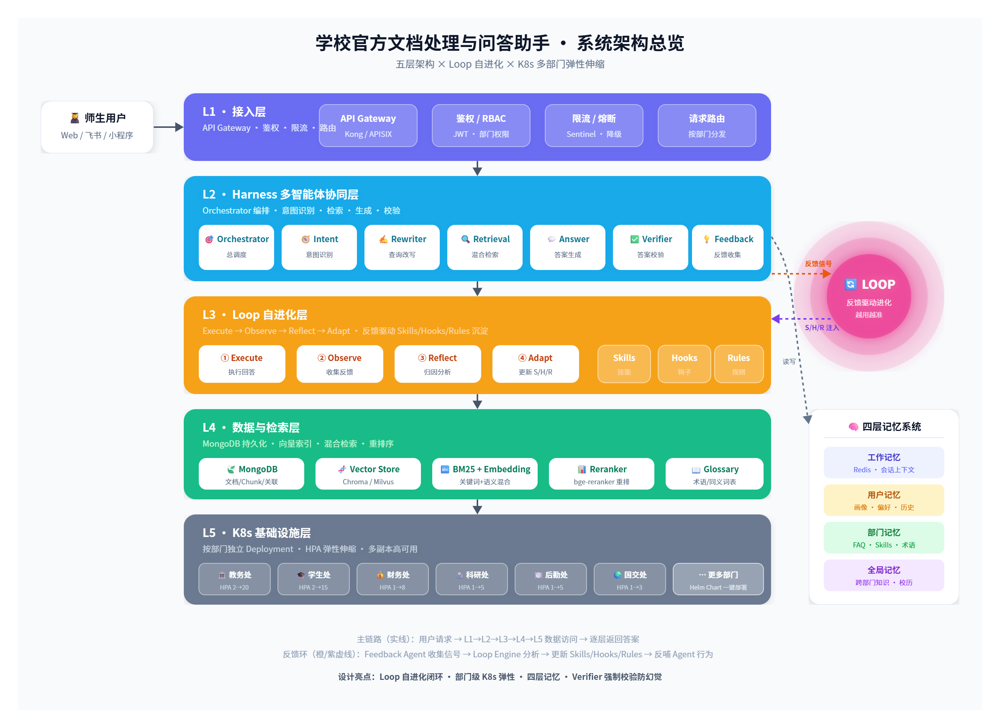
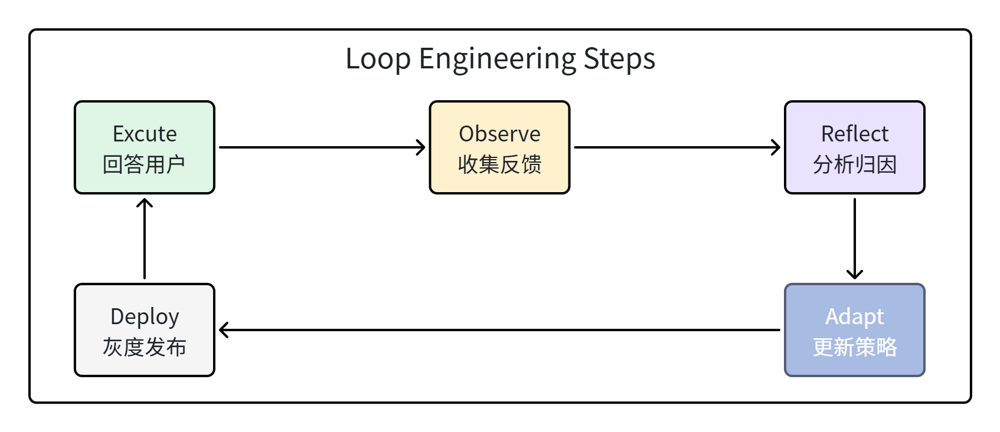
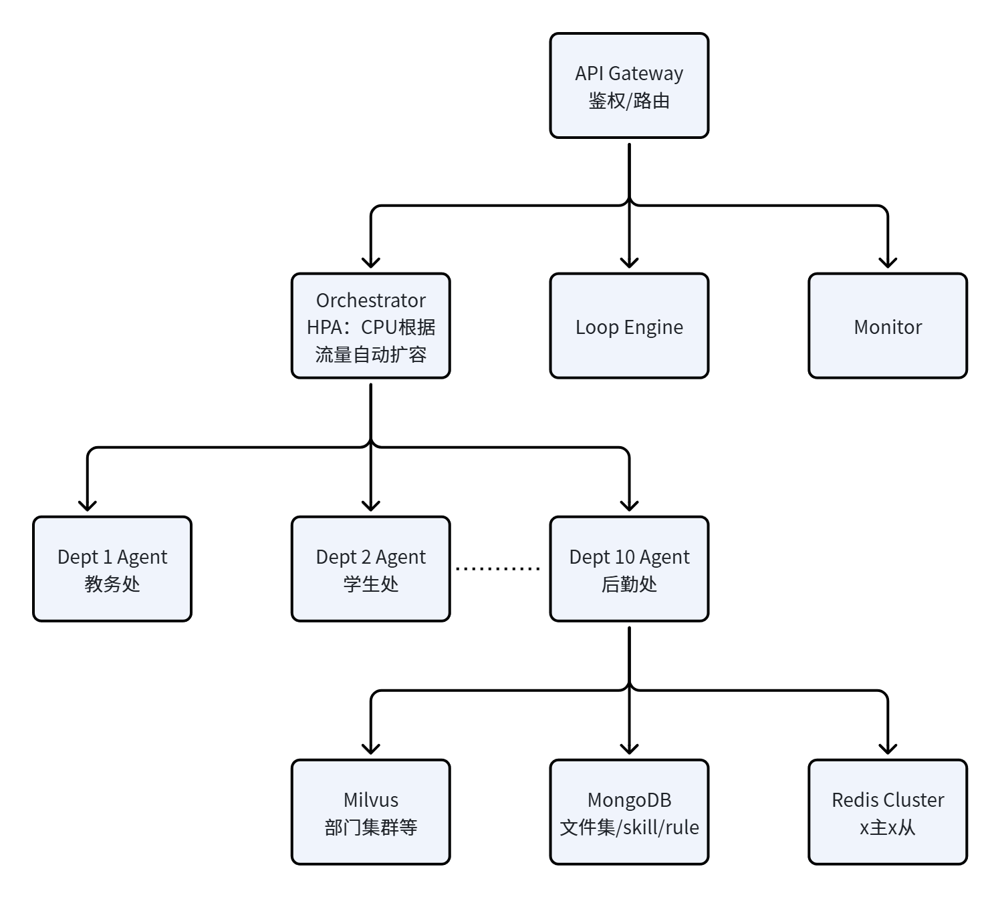

**文档定位**：可直接落地实现的工程化技术方案，覆盖数据存储、Loop 自优化、Skills 沉淀、多智能体协同、K8s 高并发五大模块。

**设计原则**：可行性优先、模块闭环、亮点突出——打通"文档入库 → 智能问答 → 自我进化"全链路。

---

## 一、项目概述

### 1.1 项目目标

构建一套面向学校多部门（教务处、学生处、财务处、人事处、后勤处、研究生院等）的官方制度文档智能处理与问答系统。核心能力：

- **统一入库**：各部门制度文档（PDF/Word/Markdown）自动解析、结构化、版本化存储到 MongoDB。

- **精准问答**：基于多智能体协同的意图识别 + 混合检索，回答师生关于制度条款的提问，并溯源到原文。

- **自我进化**：通过 Loop Engineering 让系统在真实使用中自动沉淀 Skills、Hooks、Rules，越用越准。

- **高并发弹性**：K8s 按部门粒度部署子智能体，支持开学季/选课季等突发流量。

### 1.2 核心设计理念

**Loop ≠ 重复执行**

只有当反馈信号真正改变下一轮行为时，才构成 Loop。简单的定时重跑、轮询刷新不等于 Loop 。

**人逐步退出 Loop 循环**

早期 Loop 先圈定可修改范围、定义"好"的标准，再让人逐步从 Loop 中退出，让 Loop 自己长期运行。

**记忆即能力**

系统不只记住用户偏好，更从重复行为中提炼 Skills、Hooks、Rules，形成可复用的组织知识。

### 1.3 亮点设计

**亮点 1：Loop 自进化，人在环外**

传统 RAG 系统上线后检索质量固定，本方案通过反馈闭环让系统越用越准——自动从 bad case 中提炼 Skills/Hooks/Rules，随着使用，回答质量可显著超越初始版本，**人逐步退出循环，实现真正自主运行的 Loop Engineering。**

**亮点 2：部门级 K8s 弹性，成本与性能兼得**

完善的后端微服务框架，不是一个大模型服务扛所有流量，而是按部门粒度独立弹性伸缩。冷门部门 1 个 Pod 省成本，热门部门开学季弹到 20 个 Pod 扛并发，资源利用率最优。

**亮点 3：多agent跨部门冲突检测**

不只是被动回答问题，还在文档入库时自动检测不同部门制度间的冲突条款（如教务处和研究生院对同一事项规定不一致），主动推送管理员协调，这是传统文档系统做不到的。

**亮点 4：轻量定制 Harness 框架**

不依赖 LangChain/AutoGen 等重代码框架，Agent 协作按功能需要走固定 DAG 编排，可直接生成、可调试、可维护，避免框架抽象层带来的不可控性。

---

## 二、系统整体架构

### 2.1 核心架构图



### 2.2 五层架构说明

|层级|名称|核心组件|职责|
|---|---|---|---|
|L1|接入层|API Gateway / 飞书机器人 |统一入口、鉴权、限流、请求路由到对应部门子智能体|
|L2|Harness 协同层|Orchestrator / Intent Agent / Retrieval Agent / Answer Agent / Verifier Agent|多智能体编排、意图识别、检索调度、答案生成与校验|
|L3|Loop 进化层|Loop Engine / Skill Miner / Hook Engine / Rule Engine / Feedback Collector|反馈驱动的自优化循环、Skills 自动沉淀、Hooks/Rules 动态更新|
|L4|数据与检索层|MongoDB / Vector Store(Chroma/Milvus) / Embedding Service / BM25 / Reranker|文档持久化、向量索引、混合检索、重排序|
|L5|基础设施层|K8s Cluster / Department Agent Pods / Redis / MQ / Monitoring|按部门弹性伸缩、缓存、消息队列、可观测性|

---

## 三、MongoDB 多部门制度文本存储方案

### 3.1 数据模型设计

MongoDB 选 BSON Document 模型天然适合制度文本的半结构化特征（不同部门文档字段差异大、嵌套条款多、附件多版本）。核心集合设计：

**集合 1：****`departments`****（部门元数据）**

```JSON
{
  "_id": "dept_jwc",
  "name": "教务处",
  "name_en": "Academic Affairs",
  "category": "academic",
  "admin_users": ["user_001", "user_002"],
  "agent_config": {
    "model": "gpt-4o-mini",
    "temperature": 0.1,
    "system_prompt_ref": "prompt_jwc_v3",
    "max_tokens": 2048
  },
  "created_at": "2026-01-10T08:00:00Z",
  "updated_at": "2026-07-15T14:30:00Z"
}
```

**集合 2：****`documents`****（文档主表）**

```JSON
{
  "_id": ObjectId("..."),
  "dept_id": "dept_jwc",
  "title": "本科生选课管理办法",
  "doc_type": "regulation",
  "version": "2025.2",
  "status": "active",
  "effective_date": "2025-09-01",
  "expiry_date": null,
  "supersedes": ObjectId("..."),
  "source": {
    "file_name": "选课管理办法2025.pdf",
    "file_hash": "sha256:abc123...",
    "uploaded_by": "user_001",
    "uploaded_at": "2025-08-20T10:00:00Z"
  },
  "tags": ["选课", "本科", "学分"],
  "chunk_count": 42,
  "vector_status": "ready"
}
```

**集合 3：****`chunks`****（切片表，检索最小单元）**

```JSON
{
  "_id": ObjectId("..."),
  "doc_id": ObjectId("..."),
  "dept_id": "dept_jwc",
  "chunk_index": 3,
  "section_path": ["第三章", "第十二条"],
  "section_title": "选课时间安排",
  "content": "学生应当在每学期第16-18周完成下学期选课...",
  "content_hash": "sha256:def456...",
  "char_count": 218,
  "embedding_id": "vec_xyz789",
  "keywords": ["选课时间", "下学期", "第16周"],
  "metadata": {
    "page": 5,
    "has_table": false,
    "cross_refs": ["doc_xxx#chunk_7"]
  }
}
```

**集合 4：****`doc_relations`****（跨部门文件关联）**

```JSON
{
  "_id": ObjectId("..."),
  "from_doc": ObjectId("..."),
  "to_doc": ObjectId("..."),
  "relation_type": "reference|supersede|conflict|supplement",
  "description": "选课办法引用了学分制管理规定",
  "auto_detected": true,
  "confidence": 0.92,
  "verified_by": null
}
```

### 3.2 数据处理 Pipeline

**处理流程**：上传 → 格式解析 → 清洗 → 语义切片 → 元数据提取 → 向量化 → 索引构建 → 跨部门关联挖掘。

1. **格式解析层**：用 `unstructured` / `pdfplumber` / `python-docx` / `BeautifulSoup` 统一处理 PDF/Word/HTML/Markdown，保留标题层级、表格、列表结构。

2. **清洗标准化**：去除页眉页脚水印、OCR 纠错（用 PaddleOCR 处理扫描件）、全角半角统一、繁简转换。

3. **语义切片**：不按固定 token 数硬切，而是按"条款"语义边界切——利用标题层级（章/节/条/款）+ 语义相似度（相邻段落 embedding cosine > 阈值则合并），目标 chunk 大小 300-600 字，保证每条回答可溯源到具体条款。

4. **元数据提取**：LLM 自动提取 `effective_date`、`doc_type`、`keywords`、`applicable_scope`（本科生/研究生/教职工）、`cross_refs`（引用的其他文件）。

5. **向量化**：调用 Embedding 模型（推荐 `bge-m3` 或 `text-embedding-3-small`），向量存 Chroma/Milvus，`embedding_id` 回写 MongoDB。

6. **跨部门关联挖掘**：

    - **规则层**：正则匹配文中"根据XX办法""参照XX规定"等引用模式。

    - **语义层**：不同部门文档 chunk 间 embedding cosine > 0.85 且关键词重叠率 > 0.3 时，标记为潜在关联。

    - **人工审核层**：高置信度（>0.9）自动建立关联；低置信度推入审核队列，由部门管理员确认。

### 3.3 跨部门文件管理策略

|管理维度|方案|实现方式|
|---|---|---|
|权限隔离|每个部门文档绑定 `dept_id`，查询时强制带部门过滤；跨部门查询需用户具备跨部门权限或问题本身涉及多部门（由 Intent Agent 判断）|MongoDB 复合索引 `dept_id + status`；应用层 RBAC|
|版本管理|文档更新不覆盖旧版，新版本新 `_id`，通过 `supersedes` 字段形成版本链；旧版标记 `status=archived`，检索时默认只查 `active`，但支持历史版本回溯|MongoDB `supersedes` 指针 + 状态字段|
|冲突检测|新文档入库时，自动与其他部门同类文档做语义比对，发现条款冲突（如教务处说退课截止第8周，研究生院说第10周）时标记 `conflict` 并通知相关部门|`doc_relations` 集合 + 定时扫描任务|
|统一术语表|维护 `glossary` 集合，对同一概念在不同部门的不同叫法（如"辅导员≈班主任≈导师"）建立同义词映射，检索时自动扩展|LLM 自动抽取 + 人工审核|
|生命周期|文档状态机：draft → review → active → archived → deleted；到期自动提醒发布部门复核是否需要更新|MongoDB 状态字段 + 定时 Loop 检查|

---

## 四、Loop Engineering 全流程自动化文档管理优化

### 4.1 Loop vs 自动化的边界

**关键区分**：

- **自动化（Automation）**：定时执行固定流程，输入确定、逻辑确定、输出确定。例如"每天凌晨2点重新索引新文档"——这是自动化，不是 Loop。

- **Loop（反馈循环）**：每轮执行的结果作为反馈信号输入，**改变下一轮的行为**。例如"用户点踩了回答 → 分析原因 → 调整检索策略/补充 chunk → 下次同类问题回答变好"——这才是 Loop。

### 4.2 Loop 落地三件事

**第一件事：圈出可修改范围（Mutable Scope）**

系统不是所有东西都能自动改，必须明确边界：

|可更新策略范围|可自动修改|需人工审核|不可自动修改|
|---|---|---|---|
|Skills|触发条件、参数模板|Skill 本体（Prompt 逻辑）|—|
|Hooks|触发阈值、路由规则|Hook 动作定义|—|
|Rules|权重、优先级、top-k|规则内容|—|

**第二件事：定义"什么算好"（Success Metric）**

Loop 需要明确的优化目标，否则反馈信号无法量化：

- **回答质量**：用户采纳率（点👍/点👎）、答案引用条款数（≥1条为合格）、Verifier Agent 评分（0-1分）。

- **检索质量**：Hit Rate@5（前5个 chunk 是否包含答案）、MRR（Mean Reciprocal Rank）。

- **效率指标**：首 token 延迟 < 2s、端到端 P99 < 8s、单轮对话成本 < ¥0.02。

- **覆盖指标**：无法回答的问题占比应低于 10%（可回答率 ≥ 90%）。

**第三件事：让人逐步退出循环（Human Fade-out）**

**Phase 1：人在环中（Human-in-the-loop）**

所有自动生成的 Skills/Hooks/Rules 必须人工审核后才生效。人是 100% 决策者。

**Phase 2：人在环上（Human-on-the-loop）**

高置信度（>0.9）取消人类审核，自动生效，低置信度推入审核队列；人只处理异常 case，人是审核者。

**Phase 3：人在环外（Human-out-of-the-loop）**

系统在圈定范围内全自动运行，人只设定边界和目标，定期检查复盘。人是监督者。

### 4.3 Loop Engine 核心循环



**五个阶段详解**：

1. **Execute**：按当前 Skills/Hooks/Rules 配置回答用户问题，记录完整 trace（query、intent、retrieved_chunks、prompt、answer、latency、cost）。

2. **Observe**：收集三类反馈信号

    - **显式反馈**：用户点赞/点踩、"回答有误"按钮、纠错留言。

    - **隐式反馈**：用户是否复制答案、是否追问（追问说明不满意）、会话时长。

    - **自动反馈**：Verifier Agent 自检（答案是否有引用支撑、是否与条款矛盾）、检索 Hit Rate 统计。

3. **Reflect**：LLM 分析 bad case 根因，归类为——

    - 检索问题（chunk 没切好/embedding 不准/关键词没扩展）

    - 意图问题（部门路由错了/问题类型判断错了）

    - 生成问题（幻觉/没引用/答非所问）

    - 知识缺口（文档里确实没有这个内容）

4. **Adapt**：根据根因生成对应的 Skill/Hook/Rule 更新，进入可修改范围的审核/自动生效流程。
5. **Deploy**：灰度发布，测试新策略的回复有效性，回到第一阶段循环Loop

### 4.4 Skills、Hooks、Rules 三位一体

**Skills（技能）**

"怎么做"的程序化知识。当某类问题反复出现且有稳定解法时，沉淀为 Skill。

示例：`deadline_query`——回答"XX截止时间"类问题时，自动查询当前学期校历，结合具体条款给出截止日期+倒计时。

**Hooks（钩子）**

"什么时候触发什么"的事件响应。在特定条件满足时自动触发额外动作。

示例：`cross_dept_hook`——当问题同时涉及"选课"+"缴费"时，自动同时检索教务处和财务处文档，并合并回答。

**Rules（规则）**

"必须遵守"的硬约束。优先级最高，覆盖模型默认行为。

示例：`cite_source_rule`——所有回答必须附带来源条款引用；`no_guess_rule`——文档中没有明确答案时必须说"根据现有制度文件未找到明确规定"，禁止编造。

---

## 五、Loop 过程中自动沉淀与优化 Skills

### 5.1 Skill 数据结构

每个 Skill 存储在 MongoDB `skills` 集合中：

```JSON
{
  "_id": "skill_deadline_query",
  "name": "截止时间查询",
  "dept_id": "dept_jwc",
  "scope": "global|department",
  "trigger": {
    "intent_patterns": ["截止时间", "什么时候截止", "最晚什么时候", "deadline"],
    "entities_required": ["matter"],
    "confidence_threshold": 0.75
  },
  "action": {
    "type": "workflow|prompt|tool_call",
    "steps": [
      {"step": 1, "action": "extract_entity", "params": {"entity": "matter"}},
      {"step": 2, "action": "retrieve", "params": {"query": "{matter} 截止时间", "top_k": 5}},
      {"step": 3, "action": "call_tool", "params": {"tool": "calendar_lookup", "args": {"semester": "current"}}},
      {"step": 4, "action": "generate", "params": {"template": "deadline_template_v2"}}
    ]
  },
  "metrics": {
    "trigger_count": 342,
    "success_rate": 0.91,
    "avg_latency_ms": 1800,
    "last_triggered": "2026-07-15T16:20:00Z"
  },
  "version": 3,
  "status": "active",
  "auto_generated": true,
  "created_by": "loop_engine",
  "created_at": "2026-03-01T00:00:00Z"
}
```

### 5.2 Skill 生成策略

**触发条件**：当同一类问题模式（通过 embedding 聚类识别）在 7 天窗口内出现 ≥ 20 次，且当前通用回答流程的成功率 < 80% 时，Skill Miner 启动。

**生成流程**：

1. **模式聚类**：对最近 N 条 bad case / 高频 query 做 embedding 聚类（DBSCAN），识别出稳定的问题模式簇。

2. **Trace 回放**：取出该簇内所有会话 trace，分析哪些回答成功、哪些失败，提取成功回答的共同路径。

3. **Skill 草稿生成**：LLM 基于成功路径生成 Skill 草稿（trigger 条件 + action steps），包含：

    - 触发意图模式（从问题簇中提取关键词/句式模板）

    - 所需实体（如"事项名称""年级""学期"）

    - 执行步骤（检索→工具调用→生成的编排）

    - 输出模板

4. **沙箱验证**：用历史 trace 中的问题回测新 Skill，成功率 > 85% 才进入审核队列。

5. **灰度发布**：新 Skill 先以 10% 流量灰度，对比灰度组与对照组的成功率，显著提升（p < 0.05）后全量。

### 5.3 Skill 自动优化策略

|优化维度|策略|
|---|---|
|触发条件优化|统计每个 Skill 的触发精确率（触发后成功率）和召回率（该触发时没触发的比例），自动调整 `confidence_threshold` 和 `intent_patterns`——误触发多则提高阈值、补充负例；漏触发多则降低阈值、补充关键词|
|步骤优化|对 action steps 做 A/B 测试（如 top_k=3 vs top_k=5、是否调用 calendar 工具），用多臂老虎机（Thompson Sampling）自动选择最优参数组合|
|模板优化|输出模板根据用户反馈自动微调措辞（如用户反复追问"具体是哪条"，则在模板中强制加入条款编号）|
|Skill 合并/拆分|两个 Skill 触发模式高度重叠（Jaccard > 0.8）且 action 相似时自动建议合并；一个 Skill 内部分化出两种明显不同的回答路径时自动建议拆分|
|Skill 降级/淘汰|连续 14 天触发量 < 5 次或成功率 < 60% 的 Skill 标记为 `stale`，进入归档流程；被新 Skill 替代的旧 Skill 自动 `deprecated`|

---

## 六、Harness 多智能体协同

### 6.1 Agent 定义与职责

**Harness** 指多智能体的编排框架——不是让 Agent 自由对话，而是用结构化的 harness 约束每个 Agent 的输入输出，确保意图识别准确、检索有效、答案可靠。支持标准 OpenAI API 和本地私有化部署模型的 Ollama 接口（应对隐私要求）

|Agent|角色|职责|输入 → 输出|
|---|---|---|---|
|**Orchestrator**|总调度|接收用户请求，协调各 Agent 工作流，决定走单部门直答还是跨部门协同，处理异常和超时|User Query → Execution Plan|
|**Intent Agent**|意图识别|判断问题类型（制度咨询/流程指引/ deadline 查询/投诉建议/闲聊）、涉及部门、用户身份（学生/教师/管理员）、是否需要多部门协同|Query → Intent{type, depts, user_role, entities, needs_cross_dept}|
|**Query Rewriter**|查询改写|对原始问题做改写扩展：补全省略信息（如"退课费"→"退课手续费退费标准"）、术语标准化（查 glossary）、生成多组检索 query|Intent → Rewritten Queries[]|
|**Retrieval Agent**|检索执行|执行混合检索（BM25 关键词 + 向量语义 + metadata filter），调用 reranker 重排序，返回 top-k chunks|Queries + Dept Filter → Ranked Chunks[]|
|**Answer Agent**|答案生成|基于检索到的 chunks 生成回答，严格引用来源，按 Rules 约束输出格式；跨部门问题合并多个部门子答案|Chunks + Rules → Answer with Citations|
|**Verifier Agent**|答案校验|检查：① 每个结论是否有 chunk 支撑 ② 是否与原文矛盾 ③ 是否遗漏关键信息 ④ 引用格式是否正确。不通过则打回 Answer Agent 重写（最多2次）|Answer + Chunks → Verification Result{pass, issues[]}|
|**Feedback Agent**|反馈收集|在回答后引导用户反馈，处理用户追问/纠错，将信号写入反馈队列供 Loop Engine 消费|User Reaction → Feedback Signal|

### 6.2 Agent 协作流程

```JSON
用户提问
   │
   ▼
┌─────────────┐
│ Orchestrator │ ← 读取 Skills/Hooks/Rules 配置
└──────┬──────┘
       │
       ▼
┌─────────────┐    识别意图/部门/实体
│ Intent Agent │ ──→ 需要跨部门？→ Fork 多个部门子任务
└──────┬──────┘
       │
       ▼
┌───────────────┐
│ Query Rewriter │ ──→ 术语扩展/多query生成
└──────┬────────┘
       │
       ▼
┌────────────────┐
│ Retrieval Agent │ ──→ BM25 + Vector + Rerank
└──────┬─────────┘
       │
       ▼
┌──────────────┐
│ Answer Agent │ ← 跨部门时合并多个子答案
└──────┬───────┘
       │
       ▼
┌───────────────┐
│ Verifier Agent │ ──→ 不通过？回到 Answer Agent（最多2次）
└──────┬────────┘
       │ pass
       ▼
   返回答案 + 引用
       │
       ▼
┌───────────────┐
│ Feedback Agent │ ──→ 收集反馈 → Loop Engine
└───────────────┘
```

### 6.3 记忆系统设计

记忆系统是多智能体协同的"粘合剂"，分四层：

|记忆层|存储位置|内容|生命周期|
|---|---|---|---|
|**工作记忆**|Redis（当前会话）|当前对话的上下文：最近 N 轮消息、已识别的 intent、已检索的 chunks、中间推理结果。结构为 Conversation Session 对象，TTL=30min|会话级|
|**用户记忆**|MongoDB `user_profiles`|用户画像：身份（学生/教师）、院系、年级、常用咨询部门、历史高频问题类型、偏好（如喜欢简洁回答还是详细条款引用）、反馈历史|用户级，长期|
|**部门记忆**|MongoDB `dept_memory`|部门级知识：该部门的 Skills/Hooks/Rules、常见问题 FAQ（自动从高频问答对沉淀）、术语表、已知冲突条款、热点问题趋势|部门级，长期，Loop 更新|
|**全局记忆**|MongoDB `global_memory`|跨部门共享知识：跨部门 Skills（如"休学"涉及教务处+学生处+财务处）、全局 Rules、系统级 Hooks、学期日历、全校通用术语|全局，长期|

**记忆写入策略**：

- **实时写入**：每轮对话结束后，Feedback Agent 将会话摘要写入用户记忆；高频模式实时更新部门记忆的热点计数。

- **批量写入**：Loop Engine 每日凌晨批量分析当日 trace，更新 Skills/Hooks/Rules/FAQ。

- **记忆衰减**：用户记忆中超过 180 天未激活的偏好自动降权；部门记忆中连续 90 天未触发的 FAQ 归档。

**记忆检索策略**：

- Intent Agent 启动时加载用户画像（从用户记忆）+ 全局 Rules。

- Retrieval Agent 检索时，除了查文档 chunks，还查部门 FAQ（优先匹配 FAQ 直接回答）。

- Answer Agent 生成时注入相关的部门记忆（术语、Rules）和用户偏好（简洁/详细）。

---

## 七、K8s 多部门子智能体高并发方案

### 7.1 部署架构

**核心思路**：每个部门的 Agent 栈（Intent + Retrieval + Answer + Verifier）作为一个独立的 Deployment，通过 HPA 根据 QPS 自动伸缩；Orchestrator 和 Loop Engine 作为全局服务独立部署。部门间资源隔离，避免热门部门（如教务处开学季）挤占其他部门资源。



### 7.2 部门 Agent Pod 设计

每个部门的 Agent Pod 内运行一个轻量 FastAPI 服务，加载该部门专属配置：

```YAML
# 教务处 Agent Deployment 示例
apiVersion: apps/v1
kind: Deployment
metadata:
  name: dept-agent-jwc
  labels:
    app: dept-agent
    department: jwc
spec:
  replicas: 2
  selector:
    matchLabels:
      app: dept-agent
      department: jwc
  template:
    metadata:
      labels:
        app: dept-agent
        department: jwc
    spec:
      containers:
      - name: agent
        image: school-doc-agent:v1.0
        env:
        - name: DEPT_ID
          value: "dept_jwc"
        - name: MODEL_NAME
          value: "gpt-4o-mini"
        - name: MONGODB_URI
          valueFrom:
            secretKeyRef:
              name: mongodb-secret
              key: uri
        - name: REDIS_ADDR
          value: "redis-cluster:6379"
        resources:
          requests:
            cpu: "500m"
            memory: "512Mi"
          limits:
            cpu: "2000m"
            memory: "2Gi"
---
apiVersion: autoscaling/v2
kind: HorizontalPodAutoscaler
metadata:
  name: dept-agent-jwc-hpa
spec:
  scaleTargetRef:
    apiVersion: apps/v1
    kind: Deployment
    name: dept-agent-jwc
  minReplicas: 2
  maxReplicas: 20  # 教务处峰值扩容到20个Pod
  metrics:
  - type: Pods
    pods:
      metric:
        name: http_requests_per_second
      target:
        type: AverageValue
        averageValue: "10"  # 每Pod每秒处理10个请求时扩容
  behavior:
    scaleUp:
      stabilizationWindowSeconds: 30
      policies:
      - type: Pods
        value: 3
        periodSeconds: 30
    scaleDown:
      stabilizationWindowSeconds: 300
```

### 7.3 后端高并发关键设计

|设计点|方案|技术选型|
|---|---|---|
|部门级隔离|每个部门独立 Deployment + HPA，资源互不抢占；冷门部门（如国际交流处）minReplicas=1 节省资源，热门部门（教务处/学生处）minReplicas=2、maxReplicas=20|K8s HPA + Pod 反亲和|
|多级缓存|L1 Redis 缓存高频问答对（TTL=1h）；L2 内存缓存 embedding 结果；L3 浏览器端缓存静态资源。热点问题（如"怎么选课"）直接命中缓存，不走 LLM|Redis Cluster + in-memory LRU|
|异步处理|反馈收集、Skill 挖掘、索引更新等非实时任务走消息队列（RabbitMQ/Redis Stream），不阻塞问答主链路|Redis Stream / RabbitMQ|
|流式输出|Answer Agent 支持 SSE 流式输出，首 token 延迟 < 2s，用户体验更好|FastAPI SSE + OpenAI streaming|
|限流降级|API Gateway 层按部门+用户限流；LLM 调用失败时降级到 FAQ 匹配或 Elasticsearch 原文检索；全链路超时控制（Intent 200ms / Retrieval 1s / Answer 5s）|APISIX 限流插件 + circuit breaker|
|连接池管理|MongoDB/Redis/LLM API 全部使用连接池，避免每次请求新建连接的开销；LLM API 支持批量请求合并|motor(async mongo) + aioredis|
|预热机制|开学季/选课季等已知高峰前，提前扩容热门部门 Pod、预加载热点 FAQ 到缓存、预热 embedding 索引|CronHPA + 预热脚本|

### 7.4 跨部门协同的网络通信

当 Intent Agent 判断需要跨部门回答时（如"休学后退费怎么办理"涉及教务处+学生处+财务处），Orchestrator 通过 gRPC/HTTP 并行调用多个部门 Agent：

```Python
# Orchestrator 伪代码
async def handle_cross_dept_query(query: str, depts: list[str]):
    tasks = []
    for dept_id in depts:
        # 通过 K8s Service 发现对应部门 Agent
        url = f"http://dept-agent-{dept_id}.namespace.svc.cluster.local/answer"
        tasks.append(asyncio.create_task(
            session.post(url, json={"query": query, "mode": "sub_answer"}, timeout=5)
        ))
    # 并行等待所有部门回答，超时2s的部门降级为"该部门信息暂未获取"
    results = await asyncio.gather(*tasks, return_exceptions=True)
    # Answer Agent 合并多个子答案
    merged = await answer_agent.merge_sub_answers(results, query)
    return merged
```

---

## 八、技术栈与实现路径

### 8.1 推荐技术栈

| 模块      | 技术选型                                                    | 选择理由                                                    |
| ------- | ------------------------------------------------------- | ------------------------------------------------------- |
| 后端框架    | Python 3.11 + FastAPI                                 | 异步原生、自动生成 OpenAPI 文档、生态丰富， 生成代码准确率高                     |
| 数据库     | MongoDB 7.0 (motor 异步驱动)                             | 文档模型天然适合制度文本；灵活 schema 适应不同部门字段差异；副本集保障高可用              |
| 向量检索    | Chroma（起步）→ Milvus（规模化）                                 | Chroma 轻量嵌入式，开发阶段零运维；数据量超过 100 万 chunk 后切 Milvus 集群     |
| 缓存/消息   | Redis 7 (Cluster模式)                                   | 缓存 + 会话存储 + 消息队列（Stream）三合一，减少组件数                     |
| LLM     | deepseek-v4-flash（主力）+ 本地部署 Qwen2.5-7B（兜底）         | deepseek-v4-flash 性价比高；本地模型兜底防止 API 不可用；Embedding 用 bge-m3 |
| 文档解析    | unstructured + pdfplumber + PaddleOCR + python-docx | 覆盖主流格式；PaddleOCR 处理扫描件；unstructured 保留文档结构              |
| Agent框架 | 自研轻量 Harness（不依赖 LangChain/AutoGen）                     | 本方案 Agent 交互是固定 DAG 结构，不需要重框架；自研更可控、 可直接生成              |
| 容器编排    | Kubernetes + Docker + Helm                            | 按部门弹性伸缩的核心；Helm Chart 模板化部署新部门 Agent                    |
| 可观测性    | Prometheus + Grafana + Loki + OpenTelemetry          | 指标/日志/链路追踪三位一体；快速定位 bad case                            |

### 8.2  实现顺序（建议 4 个 Sprint）

**实现原则**：每个 Sprint 产出可演示的增量，不憋大招。 按 Sprint 逐模块完成代码，每个模块独立可测试。

**Sprint 1（2周）：数据底座 + 基础问答**

- MongoDB schema 设计 + 索引创建

- 文档上传/解析/切片/向量化 Pipeline

- 基础 RAG 问答（单部门、无 Agent 协同）

- Web 聊天界面最简版

**Sprint 2（2周）：多智能体 Harness**

- Intent Agent / Retrieval Agent / Answer Agent / Verifier Agent 实现

- Query Rewriter + 混合检索（BM25 + Vector + Rerank）

- 记忆系统（工作记忆 + 用户记忆）

- 跨部门协同调用

**Sprint 3（2周）：Loop Engine + Skills 沉淀**

- Feedback 收集机制（显式+隐式+自动）

- Loop 四阶段循环（Execute/Observe/Reflect/Adapt）

- Skill Miner 自动聚类 + Skill 生成 + 沙箱回测

- Hooks / Rules 引擎

- 灰度发布机制

**Sprint 4（2周）：K8s 部署 + 高并发优化**

- Docker 镜像 + Helm Chart（部门 Agent 模板化）

- HPA 自动伸缩 + 限流降级

- Redis 多级缓存 + 流式输出

- Prometheus/Grafana 监控面板

- 压测 + 开学季高峰预案

